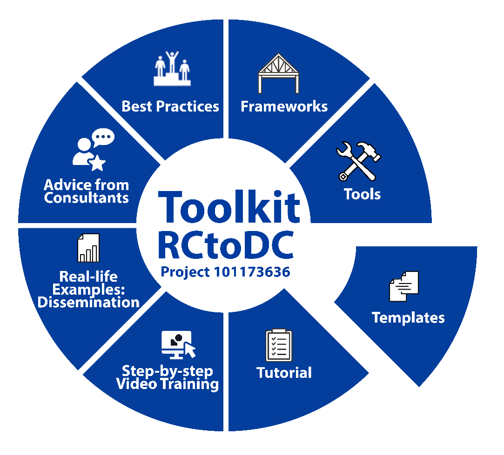
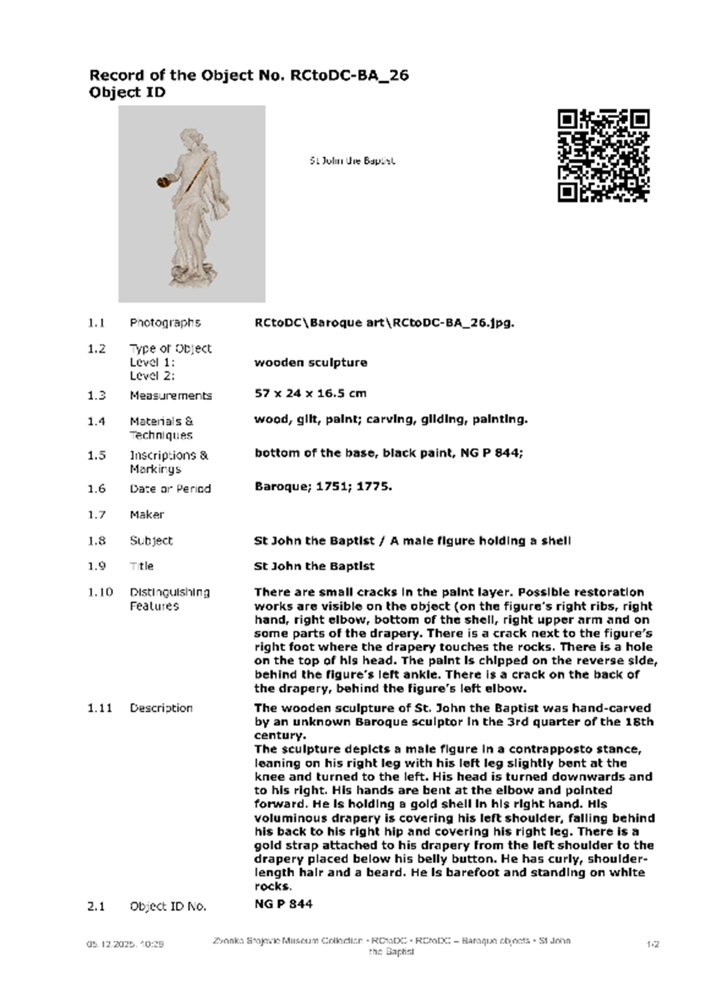
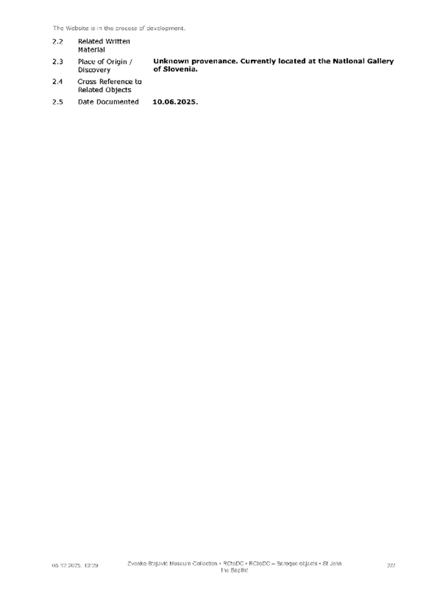

# **Module 3: TEMPLATES**

**Purpose:** Provide standardized templates for documentation and reporting.

**Content:**

**TEMPLATE**

A document used in electronic or paper media that has a pre-determined page layout and style,

which can be edited to produce required finished document.

A document template is a blueprint for generating document-style reports. The template defines what data is to be extracted from the data source and how this data is formatted in the output. Document templates are self-contained archive files with extension .dta (Document Template Archive).

[**HOME**](../README.md) | [**Previous Module**](../Module2/README.md) | [**Next Module**](../Module4/README.md)

