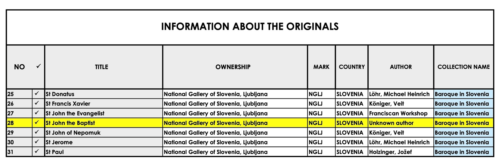
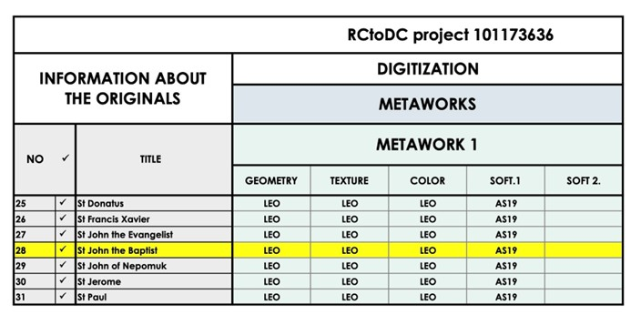
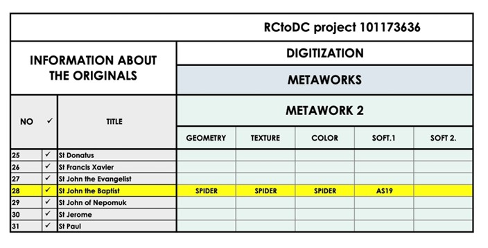
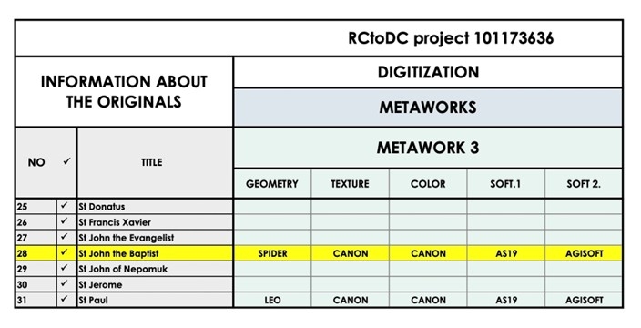
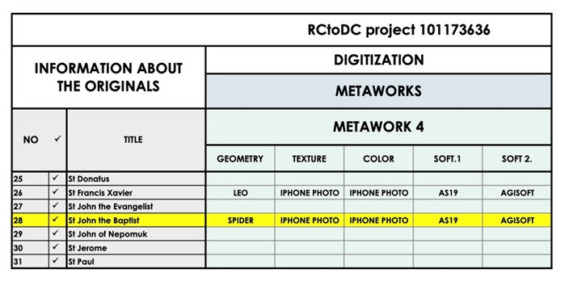
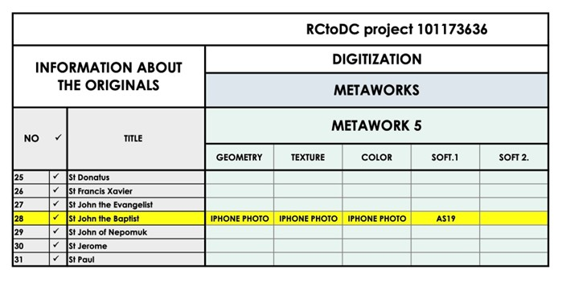
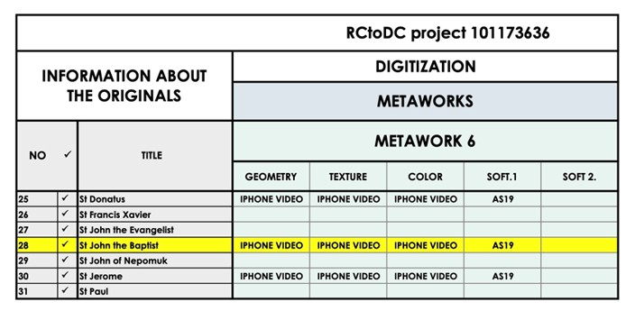
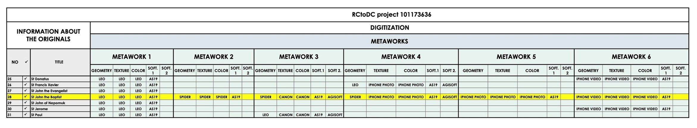

# **Module 5: VIDEO TRAINING**

**Purpose:** Provide visual education and tutorial for RCtoDC processes.

**Content:**

Out of 44 objects, we chose object number 28, St John the Baptist, as the object for presenting the step-by-step process of creating 3D and XR metaworks.

In this example, we explored five different recording equipment for scanning and two software packages for processing recorded scans.

The results of the processing are six different metaworks of the same object created by a combination of different equipment and software packages.

St John the Baptist

_Unknown author, 18th century_

The original object is part of the Baroque in Slovenia collection at the National Gallery in Ljubljana.

We recorded the object with Artec Leo Scanner.

We recorded the object with Artec Space Spider II Scanner.

We recorded the object with Canon RS Mark 2 Camera.

We recorded the object with iPhone 15 photo.

We recorded the object with iPhone 15 video.

We downloaded recorded scans from Artec Leo Scanner, Artec Space Spider II Scanner, Canon RS Mark 2 Camera and iPhone 15 to computers for further processing.

The software to support consists of different software packages listed in Toolkit under Tools, such as Artec Studio 19, Agisoft Metashape, Blender and Unreal Engine.

As a result, we produced **6 different metaworks** of the same object.

**Metawork 1** geometry, texture and color are created from recorded scans from Artec Leo Scanner processed in Artec Studio 19 software.

**Metawork 2** geometry, texture and color are created from recorded scans from Artec Space Spider II Scanner processed in Artec Studio 19 software.

**Metawork 3** geometry is created from recorded scans from Artec Space Spider II Scanner processed in Artec Studio 19. Texture and color are created from recorded scans from Canon R5 Mark 2 Camera processed in Agisoft Metashape software.

**Metawork 4** geometry is created from recorded scans from Artec Space Spider II Scanner processed in Artec Studio 19. Texture and color are created from recorded scans from iPhone photo processed in Agisoft Metashape software.

**Metawork 5** geometry, texture and color are created from recorded scans from iPhone 15 photo processed in Artec Studio 19 software.

**Metawork 6** geometry, texture and color are created from recorded scans from iPhone 15 video processed in Artec Studio 19 software.

**1\. Overview of Digitization Methods in RCtoDC**

RCtoDC supports multiple digitization approaches depending on object type, size, material, and context:

- 3D scanning (handheld scanners)
- Photogrammetry with smartphones
- Photogrammetry with photo cameras
- Video-based photogrammetry
- Metadata aggregation and database integration

Each method follows the same **core workflow**:

- Preparation
- Capture
- Processing
- Quality control
- Documentation and storage

**2\. 3D Scanning Workflow**

**2.1 Preparation**

- Inspect the object and assess fragility, reflectivity, and accessibility.
- Clean the object if permitted.
- Prepare a stable surface and controlled lighting.
- Record basic object information before scanning.

**2.2 Scanning Process**

Using handheld 3D scanners (e.g. structured-light scanners):

- Maintain consistent distance between scanner and object.
- Move slowly and evenly around the object.
- Capture all visible surfaces, including details and undercuts.
- Monitor scan quality in real time.

**2.3 Processing**

Using dedicated scanning software:

- Align individual scans
- Remove noise and artifacts
- Fuse geometry into a watertight mesh
- Apply texture and color data

**2.4 Output**

- Export files in standard formats (OBJ, PLY, STL, GLB)
- Maintain both master and derivative versions

**3\. Photogrammetry with Smartphones**

**3.1 Setup**

- Use diffuse, even lighting.
- Avoid strong shadows and reflections.
- Lock exposure and focus on the smartphone.

**3.2 Image Capture**

- Move around the object in a circular path.
- Ensure at least 60-80% overlap between images.
- Capture multiple height levels.

**3.3 Processing**

- Align images
- Generate dense point cloud
- Create mesh and texture
- Verify scale and proportions

Smartphone photogrammetry is recommended for **small to medium objects** and institutions with limited equipment.

**4\. Photogrammetry with Photo Cameras**

**4.1 Camera Setup**

- Manual mode
- Low ISO
- Fixed white balance
- Tripod recommended

**4.2 Capture Strategy**

- Consistent distance and framing
- High overlap between images
- Additional detail shots if required

This method provides **higher accuracy and texture quality** compared to smartphones and is suitable for professional digitization workflows.

**5\. Video-Based Photogrammetry**

**5.1 Video Capture**

- Slow, continuous movement around the object
- Stable camera motion
- Consistent lighting
- High-resolution recording

**5.2 Frame Extraction and Processing**

- Extract frames at regular intervals
- Remove blurred or unusable frames
- Process frames as photogrammetry input

Video-based photogrammetry is particularly useful when:

- Time is limited
- Object handling is restricted
- Continuous capture is preferred

**6\. Quality Control and Data Validation**

After processing, all 3D assets must be checked for:

- Completeness of geometry
- Accuracy of scale
- Texture clarity
- Absence of major artifacts

Only validated assets should be archived and prepared for dissemination.

**7\. Metadata Integration and Documentation**

All digitized objects must be documented using:

- Object identification metadata
- Technical digitization metadata
- Rights and usage information

The data is then prepared for:

- Internal collection management systems
- Aggregation in Axiell Collections
- Future integration into Europeana and the European Data Space for Cultural Heritage

Resources presented in the Toolkit empower cultural heritage professionals to move confidently **from raw collection to structured digital collection**, supporting the long-term goals of the European Data Space for Cultural Heritage and fostering a shared digital future for Europe's cultural assets.

[**HOME**](../README.md) | [**Previous Module**](../Module4/README.md) | [**Next Module**](../Module6/README.md)

