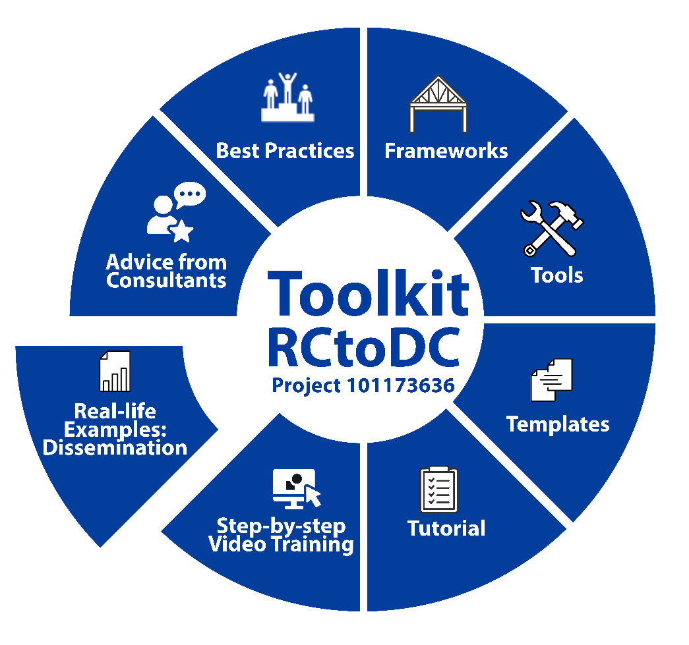

# **Module 6: REAL-LIFE EXAMPLES: DISSEMINATION**

**Purpose:**

**Content:**

5 of 44 objects created by RCtoDC project exhibited in Zvonko Stojević virtual gallery in Teslaverse - are not only exhibited but researched, played, reimagined and preserved -simultaneously in the real and virtual worlds of Teslaverse.

It shows an example how:

- Maximizes return on digitization investment
- Reduces duplication of work
- Aligns with European Data Space for Cultural Heritage goals
- Demonstrates sustainable, scalable reuse
- Positions digitized 44 baroque objects at risk from south-eastern Europe by Francesco Robba and other baroque sculptors as a **living digital ecosystem**

As an example watch [TESLAVERSE Episode 6: RCtoDC](https://youtu.be/VRRkzl8rnFI?si=DmMe_c4E7AbS4Mkc).

[**HOME**](../README.md) | [**Previous Module**](../Module5/README.md) | [**Next Module**](../Module7/README.md)

